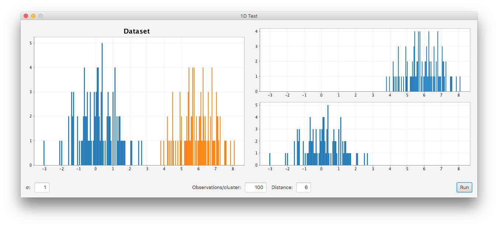

# ssc-1dtestcluster

An example of what to do with [stsc](https://github.com/ArmandGrillet/stsc).

GUI made to see the results when clustering datasets in one dimension. Accepts as parameters theta for the variance, a number of observations per clusters and the distance between them based on the positions mu. The dataset on the left is the representation of the two clusters created with a different color to see which observation is on which cluster. The histograms on the right are the clusters created from the dataset on the left.

Copyright © 2016 Armand Grillet. All rights reserved.
